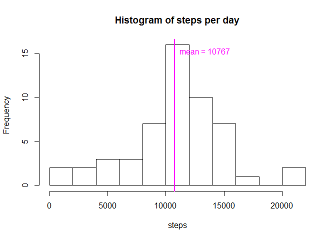
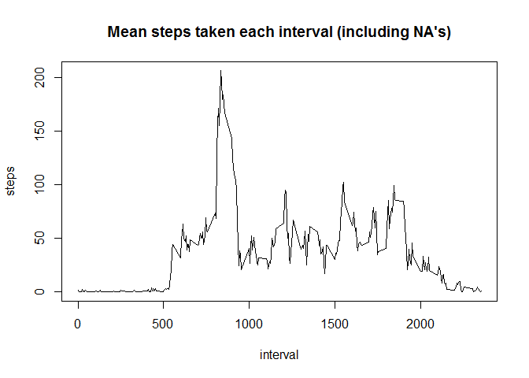
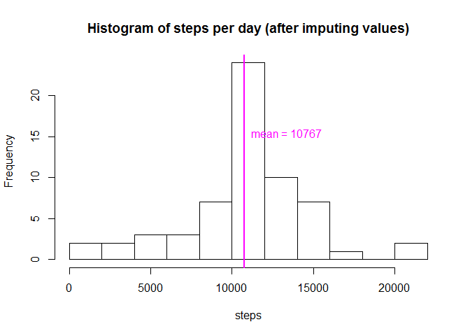

# Reproducible Research: Peer Assessment 1

```r
setwd("D:/Adam Karolewski/Studia podyplomowe/Coursera/Data Science Specialization/5 Reproducible Research/Project1/RepData_PeerAssessment1/")
```


```r
##1. Code for reading in the dataset and/or processing the data
unzip("activity.zip", exdir = ".")
df<-read.csv("activity.csv")
```


```r
##2. Histogram of the total number of steps taken each day
df2<-aggregate(steps~date,df,sum)
hist(df2$steps,breaks=10, main="",xlab="")
abline(v = mean(df2$steps), col = "magenta", lwd = 2)
title("Histogram of steps per day",xlab="steps")
text(mean(df2$steps), 15,paste("mean =",ceiling(mean(df2$steps))),col = "magenta", adj = c(-.1, .1))
```

<!-- -->


```r
##3. Mean and median number of steps taken each day
ceiling(mean(df2$steps))
```

```
## [1] 10767
```

```r
ceiling(median(df2$steps))
```

```
## [1] 10765
```


```r
##4. Time series plot of the average number of steps taken
df2<-aggregate(steps~interval,df,mean)
plot(steps~interval,data=df2, type = "l")
title("Mean steps taken each interval (including NA's)")
```

<!-- -->

```r
##5. The 5-minute interval that, on average, contains the maximum number of steps
df2[which.max(df2$steps),1]
```

```
## [1] 835
```

```r
##6. Code to describe and show a strategy for imputing missing data
#number of missing step values
nrow(df[is.na(df$steps),])
```

```
## [1] 2304
```

```r
if (is.na(df[5,1])) df$steps[5]<-df2[df2$interval==df$interval[5],]$steps
#Data imputation - i choose to imput mean on 5-minute interval into every row for the given interval
df2<-aggregate(steps~interval,df,mean)
df_i<-df
for (i in 1:nrow(df_i)){ 
    if (is.na(df_i[i,1])) df_i$steps[i]<-df2[df2$interval==df_i$interval[i],]$steps
}

##7. Histogram of the total number of steps taken each day after missing values are imputed
df3<-aggregate(steps~date,df_i,sum)
hist(df3$steps,breaks=10, main="",xlab="")
abline(v = mean(df3$steps), col = "magenta", lwd = 2)
title("Histogram of steps per day (after imputing values)",xlab="steps")
text(mean(df3$steps), 15,paste("mean =",ceiling(mean(df3$steps))),col = "magenta", adj = c(-.1, .1))
#Mean
ceiling(mean(df3$steps))
```

```
## [1] 10767
```

```r
#Median
ceiling(median(df3$steps))
```

```
## [1] 10767
```

```r
#Median has increased from 10765 to 10767

##8. Panel plot comparing the average number of steps taken per 5-minute interval across weekdays and weekends
library(lattice)
```

<!-- -->

```r
library(lubridate)
df_i$date<-as.Date(df_i$date)
df_i$weekday<-wday(df_i$date-1)
df_i$weekday_name<-""
df_i[df_i$weekday>5,]$weekday_name<-"weekend"
df_i[df_i$weekday<6,]$weekday_name<-"weekday"
df_i$weekday_name<-as.factor(df_i$weekday_name)
df4<-aggregate(steps~interval+weekday_name,df_i,mean)
xyplot(steps~interval|weekday_name,data=df4, type = "l",, layout=c(1,2))
```

<!-- -->


